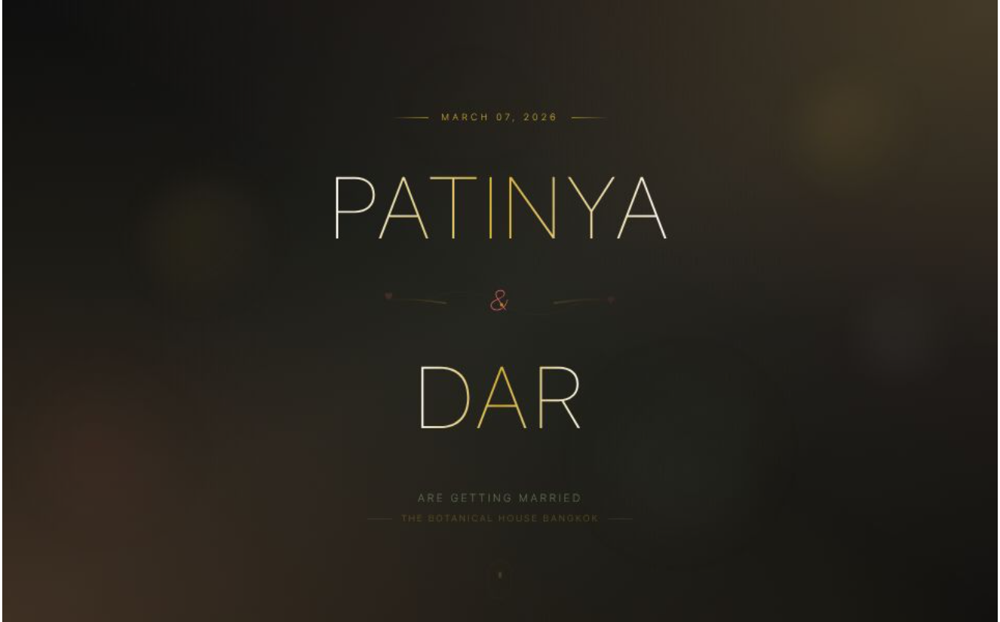

# Elegant Wedding Template - Next.js

A beautiful, modern, and fully customizable wedding invitation website built with Next.js 14, Tailwind CSS, and Framer Motion. Perfect for couples who want to share their special day with a stunning digital presence.



## ✨ Features

### 🎨 Elegant Design
- Modern, responsive design that looks beautiful on all devices
- Smooth animations powered by Framer Motion
- Customizable color schemes and themes
- Beautiful gradient backgrounds and floating elements

### 🎵 Interactive Elements
- **Background Music**: Auto-plays when users interact with the site
- **Floating Menu**: Elegant navigation that appears on scroll
- **Countdown Timer**: Dynamic countdown to your wedding day
- **RSVP Form**: Integrated form for guest responses
- **Photo Gallery**: Showcase your engagement photos

### 📱 Fully Responsive
- Mobile-first design approach
- Optimized for all screen sizes
- Touch-friendly interactions
- Fast loading times

### 🔍 SEO Optimized
- Full Open Graph support for social media sharing
- Twitter Card integration
- Structured data for rich snippets
- Customizable meta tags

## 🚀 Quick Start

### Prerequisites
- Node.js 18+ 
- npm or yarn

### Installation

1. Clone the repository:
```bash
git clone https://github.com/georgekhananaev/elegant-wedding-template-nextjs.git
cd elegant-wedding-template-nextjs
```

2. Install dependencies:
```bash
npm install
# or
yarn install
```

3. Create a `.env.local` file:
```bash
cp .env.local.example .env.local
```

4. Update the environment variables:
```env
NEXT_PUBLIC_SITE_URL=https://your-wedding-site.com
```

5. Run the development server:
```bash
npm run dev
# or
yarn dev
```

Open [http://localhost:3000](http://localhost:3000) to see your wedding website!

## ⚙️ Configuration

### Wedding Details
All wedding information is centralized in `app/config/settings.js`:

```javascript
const settings = {
  couple: {
    bride: {
      name: "Patinya",
      fullName: "Patinya Surname",
      // ... more details
    },
    groom: {
      name: "Dar",
      fullName: "Dar Surname",
      // ... more details
    }
  },
  wedding: {
    date: "2026-03-07",
    displayDate: "March 07, 2026",
    // ... venue, time details
  },
  // ... more configurations
}
```

### Customizing Content
1. **Names & Details**: Edit `app/config/settings.js`
2. **Colors**: Modify theme colors in `settings.js` and Tailwind config
3. **Images**: Replace images in `/public` folder
4. **Music**: Add your song to `/public/music.mp3`

### Adding Your Photos
1. Place venue photos in `/public/botanical-house-bkk/`
2. Add couple photos to gallery section in settings
3. Update `thumbnail.png` for social media preview

## 📂 Project Structure

```
elegant-wedding-template-nextjs/
├── app/
│   ├── components/        # React components
│   │   ├── Hero.jsx       # Landing section
│   │   ├── Countdown.jsx  # Countdown timer
│   │   ├── Gallery.jsx    # Photo gallery
│   │   ├── RSVPForm.jsx   # Guest RSVP form
│   │   └── ...
│   ├── config/
│   │   └── settings.js    # All wedding configuration
│   ├── layout.js          # Root layout with SEO
│   └── page.js            # Main page
├── public/
│   ├── music.mp3          # Background music
│   ├── thumbnail.png      # Social media preview
│   └── ...
└── package.json
```

## 🎵 Background Music

The template includes an elegant background music feature:
- Starts playing when users scroll or click
- Floating control button for play/pause
- Respects user preferences
- Optimized for browser autoplay policies

To use your own music:
1. Add your MP3 file as `/public/music.mp3`
2. The music will automatically loop
3. Volume is set to 30% by default

## 🎨 Customization Guide

### Colors
The template uses a romantic color palette:
- Primary: `#1a1a1a` (Elegant Black)
- Accent: `#d4af37` (Gold)
- Background: `#faf8f3` (Cream)
- Additional: `#87a878` (Sage), `#ff6b6b` (Coral)

### Fonts
- Headings: Playfair Display (Elegant serif)
- Body: Inter (Clean sans-serif)

### Components
Each component is fully customizable:
- Edit component files in `/app/components/`
- Adjust animations in component files
- Modify styles using Tailwind classes

## 📸 Screenshots

### Desktop View
- Elegant hero section with animated elements
- Smooth scrolling between sections
- Interactive countdown timer

### Mobile View
- Responsive navigation
- Touch-optimized interactions
- Perfect formatting on all devices

## 🔧 Development

### Available Scripts

```bash
# Development server
npm run dev

# Production build
npm run build

# Start production server
npm start

# Lint code
npm run lint
```

### Tech Stack
- **Framework**: Next.js 14 (App Router)
- **Styling**: Tailwind CSS
- **Animations**: Framer Motion
- **Icons**: Lucide React
- **Font**: Google Fonts (Playfair Display, Inter)

## 📦 Deployment

### Vercel (Recommended)
1. Push your code to GitHub
2. Import project to Vercel
3. Add environment variables
4. Deploy!

### Other Platforms
The template can be deployed to any platform that supports Next.js:
- Netlify
- AWS Amplify
- Google Cloud Run
- Self-hosted with Node.js

## 🤝 Contributing

Contributions are welcome! Please feel free to submit a Pull Request.

1. Fork the repository
2. Create your feature branch (`git checkout -b feature/AmazingFeature`)
3. Commit your changes (`git commit -m 'Add some AmazingFeature'`)
4. Push to the branch (`git push origin feature/AmazingFeature`)
5. Open a Pull Request

## 📄 License

This project is licensed under the MIT License - see the [LICENSE](LICENSE) file for details.

## 👨‍💻 Author

**George Khananaev**
- GitHub: [@georgekhananaev](https://github.com/georgekhananaev)

## 🙏 Acknowledgments

- Built with love for Patinya & Dar's special day
- Inspired by modern wedding design trends
- Thanks to the Next.js and React communities

## 💝 Support

If you found this template helpful, please consider:
- ⭐ Starring the repository
- 🍴 Forking for your own use
- 📢 Sharing with others who might need it

---

Made with ❤️ by George Khananaev | 2025